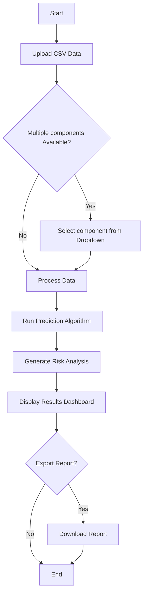

# <Project_NickName> (TBA)

> A predictive maintenance solution for the Airport Authority of India (AAI)

## Overview

<Project_NickName> is an advanced tool designed to assist in **risk analysis** and **fault prediction** of aircraft components. By leveraging machine learning models, this system helps maintenance teams identify potential failures before they occur, ensuring aviation safety and operational efficiency.

## Project Workflow

| Step | Description |
|------|-------------|
| 1 | Upload aircraft component data in `.csv` format |
| 2 | Select prediction model from dropdown (if multiple models are available) |
| 3 | System processes data through the ML model |
| 4 | View comprehensive risk analysis/dashboard and fault predictions |
| 5 | Generate and export maintenance reports |

## System Flow


## Tech Stack

<!-- EDIT THIS AFTER TECH STACK FINALLING -->

<!-- ### Machine Learning
- **Python** - Core ML development
- **Scikit-learn** - Model training and evaluation
- **Pandas & NumPy** - Data processing and analysis
- **TensorFlow/PyTorch** - Deep learning models (if applicable)

### Backend
- **Flask/FastAPI** - API framework
- **SQLite/PostgreSQL** - Data storage
- **Joblib/Pickle** - Model serialization -->

### Frontend
- **React** - User interface
- **Tailwind CSS** - Styling
- **Axios** - API communication
<!-- - **Chart.js/D3.js** - Data visualization -->

<!-- ### DevOps
- **Git** - Version control
- **pytest** - Testing framework
- **Docker** - Containerization (optional) -->

## Key Features

- Multi-model support for different component types
- Real-time risk scoring and predictions
- Interactive results dashboard
- Historical trend analysis
- Exportable maintenance reports
- User-friendly interface for technical and non-technical staff

## Installation
<!-- ```bash
# Clone the repository
git clone <repo-url>
cd <project-directory>

# Install dependencies
pip install -r requirements.txt

# Run the application
python app.py
``` -->

## Usage

1. Launch the application
2. Navigate to the upload section
3. Select and upload your component data (`.csv`)
4. Choose the appropriate prediction model
5. Review risk analysis and predictions
6. Export reports as needed

## Data Format Requirements

Input CSV files should include:
- will be added soon

<!-- - Component ID and type
- Operational parameters
- Historical maintenance records
- Sensor readings (if available)
- Timestamp data -->

## Contributing

**This is a private project with restricted access.**

Before contributing:
1. Read [CONTRIBUTING.md](CONTRIBUTING.md) thoroughly
2. Understand the existing codebase structure
3. Ensure you have been assigned a specific task
4. Only work on your assigned responsibilities

Key points:
- Git is initialized in the root directory only
- Do not modify the existing file structure
- Only assigned team members may contribute
- Follow code guidelines and PR process outlined in CONTRIBUTING.md

<!-- ## Project Structure
```
project-root/
├── data/                 # Data files (not committed)
├── models/              # Trained ML models
├── src/
│   ├── ml/             # ML model code
│   ├── server/         # Backend API
│   └── client/         # Frontend code
├── tests/              # Test files
├── docs/               # Documentation
├── requirements.txt    # Python dependencies
├── README.md
└── CONTRIBUTING.md
``` -->

<!-- ## License

Proprietary - Airport Authority of India (AAI) -->


---


*Ensuring aviation safety through predictive analytics*