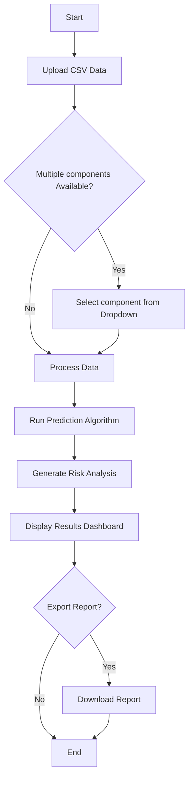

# **AERISK (Aviation Risk Analysis System)**

> A predictive maintenance solution for the Airport Authority of India (AAI)

## Overview

**AERISK (Aviation Risk Analysis System)** is an advanced tool designed to assist in **risk analysis** and **fault prediction** of aircraft components. By leveraging machine learning models, this system helps maintenance teams identify potential failures before they occur, ensuring aviation safety and operational efficiency.

## Quick Navigation
Where | Why
-- | --
[Active Issues](https://github.com/shivamm-verma/AAI_Risk-analysis_Fault-Prediction/issues) | Find all the current listed issues which requires completion
[Roadmap & deadlines](https://github.com/users/shivamm-verma/projects/7) | To ensure smooth movements, check the deadlines/roadmap to completion of each issue

## Deployment

| Component | Platform | URL |
|---------|----------|-----|
| Frontend | Vercel | https://risk-analysis-fault-prediction.vercel.app/ |
| Backend | Render | https://aai-risk-analysis-fault-prediction.onrender.com/docs |


## Project Workflow

| Step | Description |
|------|-------------|
| 1 | Upload aircraft component data in `.csv` format |
| 2 | Select prediction model from dropdown (if multiple models are available) |
| 3 | System processes data through the ML model |
| 4 | View comprehensive risk analysis/dashboard and fault predictions |
| 5 | Generate and export maintenance reports |

## System Flow
<details>
<summary>🚨 Click to expand the Mermaid flowchart</summary>
    


</details>

## File structure 
(as of 04-02-2026)

<details>
  <summary>🚨 Click to view Project Structure</summary>

```text
AAI_Risk analysis_Fault Prediction
├── .gitignore
├── CONTRIBUTING.md
├── LICENSE
├── ReadMe.md
├── .github
│   └── workflows
│       ├── keep_alive.yml
│       └── WORKFLOW_GUIDE.md
├── Client
│   ├── .env.local
│   ├── .env.production
│   ├── .gitignore
│   ├── eslint.config.js
│   ├── index.html
│   ├── package.json
│   ├── package-lock.json
│   ├── README.md
│   ├── vite.config.js
│   ├── public
│   │   └── logo.png
│   └── src
│       ├── App.jsx
│       ├── index.css
│       ├── main.jsx
│       ├── assets
│       │   └── react.svg
│       ├── components
│       │   ├── Footer.jsx
│       │   ├── Header.jsx
│       │   ├── Layout.jsx
│       │   └── Navbar.jsx
│       └── pages
│           ├── About.jsx
│           ├── Dashboard.jsx
│           ├── Home.jsx
│           └── Tools.jsx
├── Model
│   ├── durability.pkl
│   ├── LandingGearRUL.pkl
│   ├── dataset
│   │   ├── aerospace_structural_design_dataset.csv
│   │   ├── LandingGear_Balanced_Dataset.csv
│   │   └── CMAPSSData
│   │       ├── Damage Propagation Modeling.pdf
│   │       ├── readme.txt
│   │       ├── RUL_FD001.txt
│   │       ├── RUL_FD002.txt
│   │       ├── RUL_FD003.txt
│   │       ├── RUL_FD004.txt
│   │       ├── test_FD001.txt
│   │       ├── test_FD002.txt
│   │       ├── test_FD003.txt
│   │       ├── test_FD004.txt
│   │       ├── train_FD001.txt
│   │       ├── train_FD002.txt
│   │       ├── train_FD003.txt
│   │       ├── train_FD004.txt
│   │       └── .ipynb_checkpoints
│   │           └── train_FD001-checkpoint.txt
│   ├── Jupyter Notebook
│   │   ├── durabilityrequirements.txt
│   │   ├── LandingGear.ipynb
│   │   ├── remaining_useful_life.ipynb
│   │   └── structural_integrity.ipynb
│   └── rul_lstm_model
│       ├── fingerprint.pb
│       ├── keras_metadata.pb
│       ├── saved_model.pb
│       └── variables
│           ├── variables.data-00000-of-00001
│           └── variables.index
└── Server
    ├── .python-version
    ├── Dockerfile
    ├── fly.toml
    ├── README.md
    ├── requirements.txt
    ├── runtime.txt
    └── app
        ├── __init__.py
        ├── main.py
        └── model_registry.py
```
</details

Recreate the latest directory structure by the following command in the `Powershell`(Windows) terminal:
```sh
# Install once
Install-Module PSTree -Scope CurrentUser

# Use whenever needed
Get-PSTree -Recurse -Exclude "node_modules", ".venv", "__pycache__" | Select-Object -ExpandProperty Hierarchy
```


## Tech Stack

<!-- EDIT THIS AFTER TECH STACK FINALLING -->

<!-- ### Machine Learning
- **Python** - Core ML development
- **Scikit-learn** - Model training and evaluation
- **Pandas & NumPy** - Data processing and analysis
- **TensorFlow/PyTorch** - Deep learning models (if applicable)

### Backend
- **Flask/FastAPI** - API framework
- **SQLite/PostgreSQL** - Data storage
- **Joblib/Pickle** - Model serialization -->

### Frontend
- **React** - User interface
- **Tailwind CSS** - Styling
- **Axios** - API communication
<!-- - **Chart.js/D3.js** - Data visualization -->

- More tech stack will be revealed soon.

<!-- ### DevOps
- **Git** - Version control
- **pytest** - Testing framework
- **Docker** - Containerization (optional) -->

## Key Features
- will be added soon


## Installation
- will be added soon

<!-- ```bash
# Clone the repository
git clone https://github.com/shivamm-verma/AAI_Risk-analysis_Fault-Prediction.git
cd <project-directory>

# Install dependencies
pip install -r requirements.txt

# Run the application
python app.py
``` -->

## Usage

1. Launch the application
2. Navigate to the upload section
3. Select and upload your component data (`.csv`)
4. Choose the appropriate prediction model
5. Review risk analysis and predictions
6. Export reports as needed

## Data Format Requirements

Input CSV files should include:
- will be added soon

<!-- - Component ID and type
- Operational parameters
- Historical maintenance records
- Sensor readings (if available)
- Timestamp data -->

## Contributing

**This is a private project with restricted access.**

Before contributing:
1. Read [CONTRIBUTING.md](CONTRIBUTING.md) thoroughly
2. Understand the existing codebase structure
3. Ensure you have been assigned a specific task
4. Only work on your assigned responsibilities

Key points:
- Git is initialized in the root directory only
- Do not modify the existing file structure
- Only assigned team members may contribute
- Follow code guidelines and PR process outlined in CONTRIBUTING.md

<!-- ## Project Structure
```
project-root/
├── data/                 # Data files (not committed)
├── models/              # Trained ML models
├── src/
│   ├── ml/             # ML model code
│   ├── server/         # Backend API
│   └── client/         # Frontend code
├── tests/              # Test files
├── docs/               # Documentation
├── requirements.txt    # Python dependencies
├── README.md
└── CONTRIBUTING.md
``` -->

<!-- ## License

Proprietary - Airport Authority of India (AAI) -->


---


*Ensuring aviation safety through predictive analytics*
